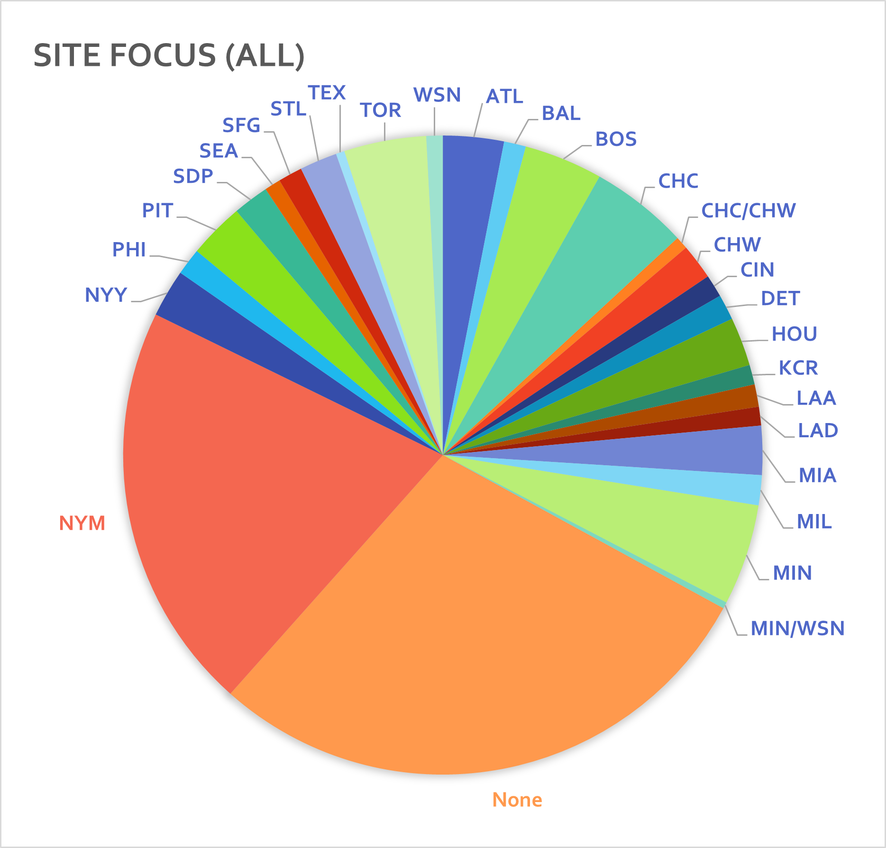
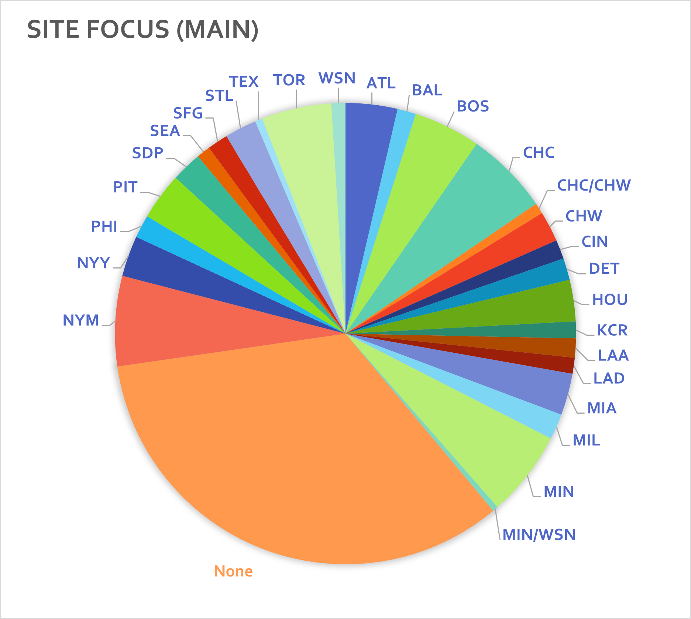

# Article Statistics

<!-- TODO: describe corpus, provide tables of stats on present (+ removed?) articles by site -->

|           Site Name            | Article Count |   Team  |
|:------------------------------:|:-------------:|:-------:|
|         mlbtraderumors         |     33,156    |   None  |
|         bosoxinjection         |     5,042     |   BOS   |
|          jaysjournal           |     5,405     |   TOR   |
|           twinsdaily           |     5,290     |   MIN   |
|          cubsinsider           |     5,211     |   CHC   |
|           rumbunter            |     4,040     |   PIT   |
| housethathankbuilt1 |     4,423     |   ATL   |
|          yanksgoyard           |     3,475     |   NYY   |
|        baseballmusings         |     3,869     |   None  |
|        climbingtalshill        |     2,862     |   HOU   |
|          marlinmaniac          |     2,587     |   MIA   |
|          redbirdrants          |     2,729     |   STL   |
|        reviewingthebrew        |     2,188     |   MIL   |
|       southsideshowdown        |     2,593     |   CHW   |
|           metsdaddy            |     2,945     |   NYM   |
|        aroundthefoghorn        |     1,756     |   SFG   |
|         blogredmachine         |     1,639     |   CIN   |
|         districtondeck         |     1,194     |   WSN   |
|           dodgersway           |     1,364     |   LAD   |
|          friarsonbase          |     1,339     |   SDP   |
|          halohangout           |     1,632     |   LAA   |
|        kingsofkauffman         |     1,432     |   KCR   |
|        motorcitybengals        |     1,859     |   DET   |
|          puckettspond          |     1,804     |   MIN   |
|          risingapple           |     1,963     |   NYM   |
|            sodomojo            |     1,174     |   SEA   |
|       thatballsouttahere       |     1,322     |   PHI   |
|        newbaseballmedia        |     1,791     |   None  |
|           metsminors           |     1,027     |   NYM   |
|       northsidebaseball        |     1,934     |   CHC   |
|           sportrelay           |     1,287     |   None  |
|     faithandfearinflushing     |     1,252     |   NYM   |
|          birdswatcher          |      950      |   BAL   |
|            fansided            |      814      |   None  |
|          nolanwritin           |      626      |   TEX   |
|           chipalatta           |      679      |   HOU   |
|         ontapsportsnet         |      916      | CHC/CHW |
|        eastvillagetimes        |      935      |   SDP   |
|        pickinsplinters         |      470      | MIN/WSN |
|         rotoprospects          |      134      |   None  |
|          twinstrivia           |      261      |   MIN   |
|          fishonfirst           |      975      |   MIA   |
|           jayscentre           |      576      |   TOR   |
|         padresmission          |      334      |   SDP   |
|            talksox             |      672      |   BOS   |
|           thespitter           |      111      |   None  |
|         orioleshangout         |      643      |   BAL   |
|         philliesnation         |      634      |   PHI   |
|            mets360             |      502      |   NYM   |
| metsmerizedonline2  |     22,063    |   NYM   |

Footnotes:
1. Also under previous site name 'tomahawktake'.
2. Source excluded from main experiments for data balance.

Chart of corpus representation by team, including all sites in the table above:

Chart of corpus representation by team, only including sites in main experiment (i.e. excluding *metsmerizedonline*):

