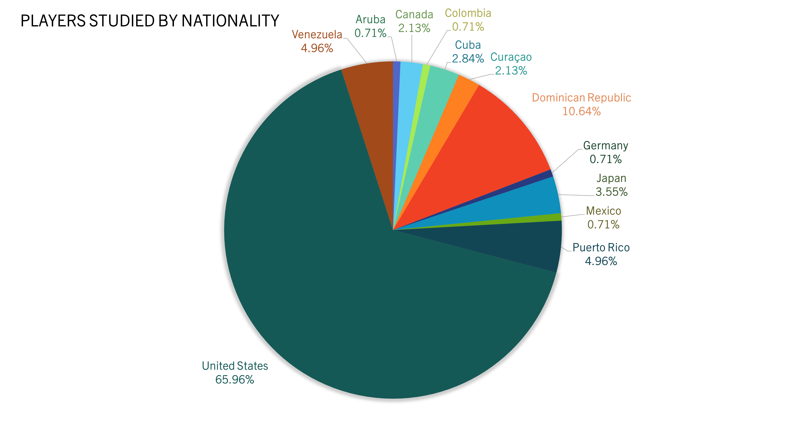
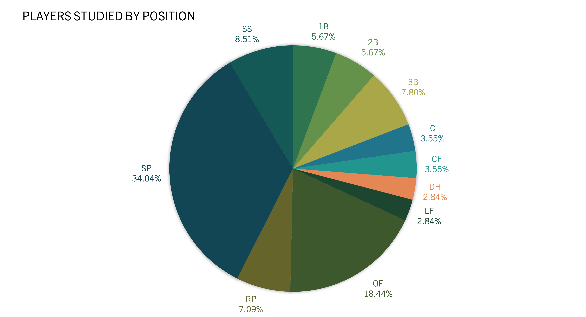
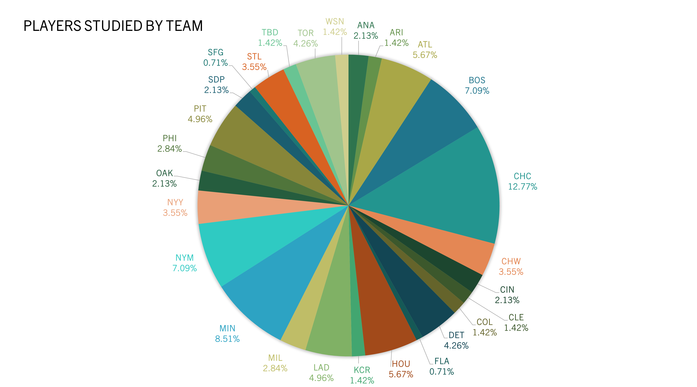
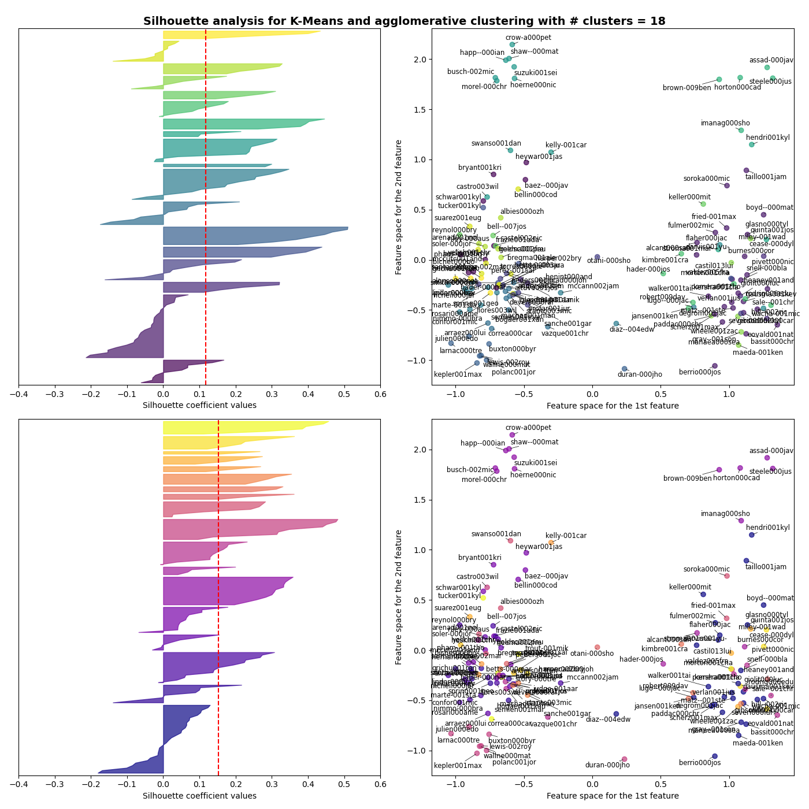
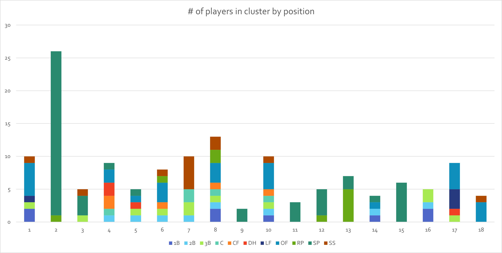
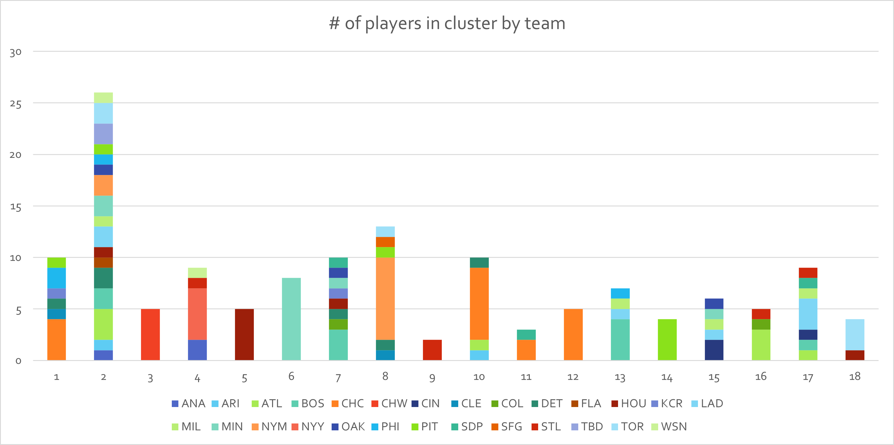
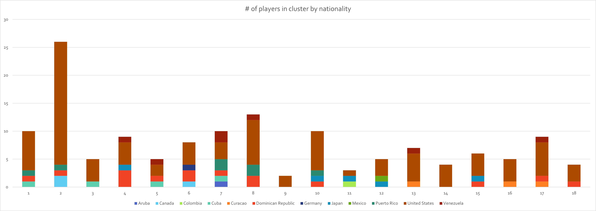
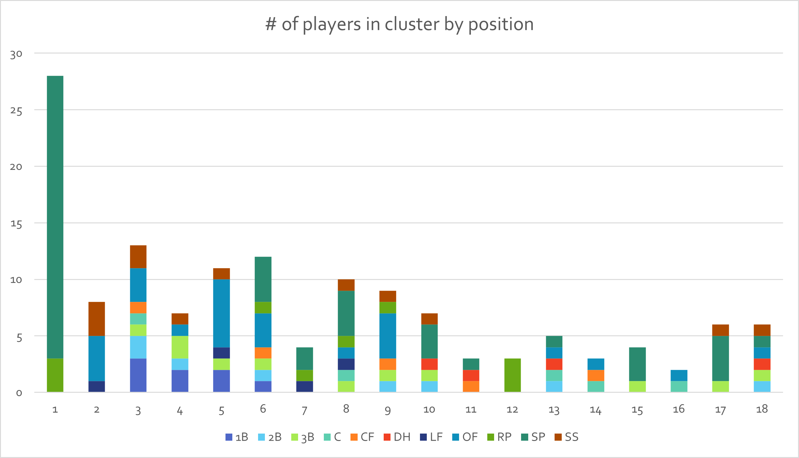
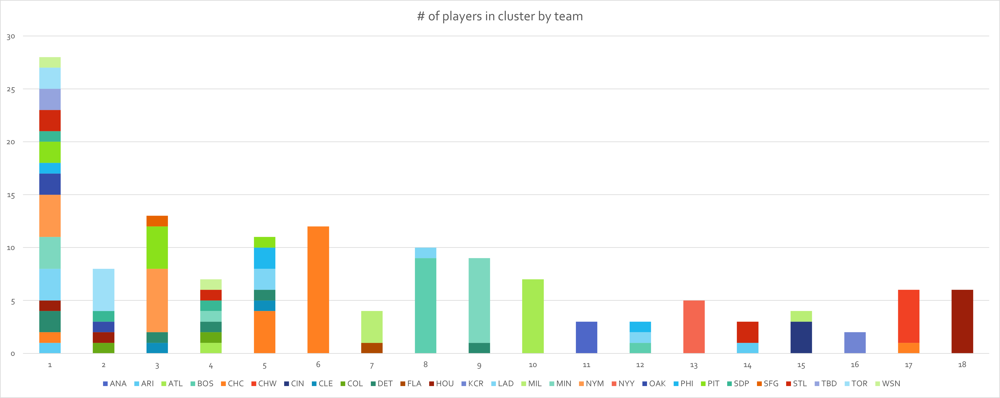
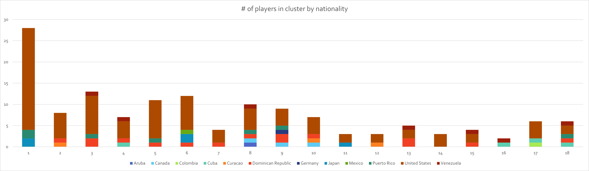

# Words Above Replacement: A Computational Approach to Analyzing Baseball Writing
**Date:** May 8, 2026
**Author:** Lindsay Dial (ledibr)  
**Affiliation:** Michtom School of Computer Science, Brandeis University  
_Capstone project submitted in partial fulfillment of the requirements for the degree of Master of Science 
in Computational Linguistics._

## Introduction
From the dawn of professional baseball, the way a player appears in the papers 
    has mattered to the public as much as their performance on the field. 
    Sportswriting has always involved judgments of statistics as well as character, 
    and evidence of bias—especially racial bias—has been thoroughly documented 
    in everything from blog posts to internal scouting reports. 
    But there is only so much that we, as human readers, can discern, 
    which made me wonder: what if there is more to the media’s language 
    than meets the eye? What sentiments are expressed that we may not easily perceive? 
    And is it possible for us to learn something new about a player’s potential 
    from the way that people talk about them?

In this project, I use publicly available online baseball writing from the last ten years to 
build distributed semantic representations of baseball players in the form of entity embeddings.
I then use them to explore a number of questions, including:
- What players are written about most similarly?
- Do these similarities appear based on race, nationality, position, team, or other factors?
- What particular words, whether "objective" descriptors or more "subjective"
  personal commentary, are most closely associated with certain players (and groups)?
- How does language correlate with play-based statistics, and can past writing
  predict future performance?

By using broader linguistic context, my research will provide unprecedented insight
  into how MLB players are depicted in the kind of writing that millions of fans 
  read every day. To my knowledge, this kind of large-scale computational analysis 
  of both bias and predictive potential in public-facing baseball writing 
  has never been performed before. Beyond answering my research questions, 
my work aims to expand the current landscape of baseball NLP to advance 
the field of sabermetrics and support future research in this area.

The contributions of this project are as follows: to analyze attitudes and trends in baseball
writing, I train Word2Vec embeddings mapping words and target entities into a shared vector space
on a corpus of articles sourced from online blogs and journalism outlets. In addition to evaluating
the results of clustering these entity embeddings, I compute word similarity scores between
player and non-player embeddings, examining them qualitatively as well as quantitatively comparing
them to different baseball statistics. Finally, I conduct a basic exploration of the predictive
potential of such embeddings by evaluating correlations between player similarity scores and
WAR values.

My discussion begins with a description of my data in [section 1](#data) and the embedding construction process in 
[section 2](#embeddings). I outline my experimental setup in [section 3](#experiments),
followed by an analysis of my results in [section 4](#results). I review my conclusions, 
contributions, and plans for future work, in [section 5](#conclusion), as well as addressing
the project's limitations in [section 6](#limitations).

## Data

The data for this project was sourced from a SQL dump of tables from Baseball Reference (Sports Reference LLC, 2025)
provided by Sean Forman. The SQL dump contains tables of player biographical information
and statistics by season, team information and statistics by season, and information on
articles linked to player pages from their internal feed. Baseball Reference (hereafter referred to as BRef) 
maintains a directory of sites in a SQL table that contribute to the player newsfeed; articles are linked
to players based on site authors' usage of the BRef "Player Linker Functionality", and the article-player
associations are stored in another SQL table. A third SQL table holds information on each individual article,
including the associated site ID, article URL, and date inserted. The database provided to me contains data
up to December 29, 2025.

To make the data usable, I converted the dump file from its MariaDB-compatible format to a SQLite-parsable dialect
and imported it into a database. I then created two new tables compiling the information necessary
to begin retrieving article data and identifying players:
- **new_articles_players:** A table mapping article IDs to player IDs, correcting instances of multiple different IDs
  for the same player appearing and removing duplicates.
- **new_player_data:** A table listing each player's ID, total number of articles linked to them, and the years of their
  first and last seasons (through 2025).

The text corpus used in the project's central experiments consists of 121,816 unannotated articles 
from 49 different sites published between 2016 and 2025. To collect article data, I downloaded webpages from the 
article URLs provided in the BRef database using the `requests` library. The articles were first filtered based on 
the following criteria:
- Article inserted into database no earlier than January 1, 2016
- Parent website's latest entry in the database no earlier than December 2025 (to reduce the risk of trying to pull
  from dead sites and prioritize actively-read websites)
- Article ID associated with player ID of a player with at least 1,000 articles (to focus on players with a significant
  amount of associated data)

These criteria produced a set of 218,758 articles. Before fixing any request errors, 145,770 of these webpages were
successfully requested. A SQL table called 'request_data' was created to keep track of relevant metadata: article ID,
article URL, timestamp of request/modification, download status (as a boolean success indicator, later an integer value
indicating stage of text processing), name of storage file, site HTTP headers, and request exceptions (if any arose).
A number of issues arose during the article collection process, including: `TooManyRequests`, `ConnectionError`, 
`Timeout`, `HTTPError`, and other exceptions raised by the `requests` library; webpages with captchas that
allegedly downloaded successfully, but in reality only displayed text indicating the captcha's presence; invalid URLs;
paywalls; and sites that did not throw a logged exception, but did not return any content when downloaded.
When possible, I attempted to resolve these errors and re-download articles, successfully increasing the number of
downloaded articles to 183,617; when the error could not be resolved, the article was removed from the target set.
Some successfully downloaded webpages were also removed based on their content, including those with irrelevant content,
extremely difficult-to-parse HTML, and pages from non-English websites.

After downloading all webpage content and correcting errors, I examined the HTML of each distinct website to identify
the tags used for the main content. Using that information, I parsed all downloaded articles to extract their body 
content, excluding elements like the title and author(s). To ensure the parsing operated correctly, I parsed a small
sample of articles from each website and tweaked the process as necessary upon encountering errors until I felt
confident in running the parsing script on the entire set of articles from that site.

After extracting the article content from its HTML, I removed more articles from the target set, including: articles
with files under 400 bytes, catching empty articles and extremely short blog posts; articles from sites with fewer than
100 articles; and articles from sites with generally low-quality writing (e.g. frequent spelling errors). I then
cleaned up the article content by systematically removing pieces of extraneous text via simple text filtering, using
the `re` library for regex functionality. Common "problem strings", such as image captions, "Thanks for reading!"
messages, and un-embedded links, were identified for each site during the HTML parsing process. Final preprocessing
of the text data was achieved by using `gensim` functions to perform standard tokenization, lowercasing,
Unicode normalization and de-accenting, and stripping extraneous whitespace. Stopwords were not removed from the data.

The final corpus used in the main experiments consists of 121,816 documents containing 72,043,079 tokens, 83,821
unique types, and 714,086 identified mentions of players in the target set. One additional team-specific site was
used in some early experiments and the grid search process, but was ultimately excluded from the data to reduce
dataset imbalance, as it had 22,063 articles present in the corpus (for a total corpus size of 143,879 documents).
A full list of the sites in the corpus, their number of articles, and their team focus (if any) can be found in
the [Article Statistics doc](docs/articles.md).

## Embeddings

### Setup

Development of entity embeddings relied on a process of replacing player mentions with a unique token allowing
all mentions to be unified. Condensing mentions into one token also enables the mapping of entities into the same
vector space as non-entity words. The mention replacement process was performed with relatively simple regex, first
targeting a given player's full name before searching for their last name alone. This helped to correctly identify
articles in which players were mentioned instead of relying on the provided article-player mappings, which were
not entirely accurate. Mention counts were tracked for each player by using `re.subn` to replace mentions. Articles
with no player mentions were left in the corpus to provide additional training data for non-entity word embeddings.

To identify the set of players for the main experiment, as well as the smaller set of players used for grid
search and functionality testing, players were filtered based on a minimum article count threshold. For the main
experiment, this was set at 1,000 articles, counted based on the article-player mapping data. Some players were
excluded from experiments due to "problem names", e.g. names with internal punctuation or names shared with other
players (see [section 6](#limitations) for in-depth examples). Before performing player mention replacement, 
team information was masked to limit the influence of team mentions on the player embeddings. Location, noun
(singular and plural, plus alternate forms as necessary), abbreviation, and league names were masked with
placeholders (e.g. ##TEAM).

### Grid Search

The grid search process involved tuning the number of vector dimensions, initial learning rate,
context window size, negative sampling value, downsampling frequency value, and number of training
epochs. Two rounds of grid search were performed, both using the same set of players for evaluation.
This set of 24 players was manually selected from players heavily represented in the data, distributed across
a select set of teams (one per division) as well as across positions (pitcher, shortstop, outfielder,
other non-catcher position player). Loss was tracked during the training process as a measure of convergence
for epoch values, though it was ultimately not especially useful.

Hyperparameters tested across both rounds of grid search:

|   Parameter  |         Values         |
|:------------:|:----------------------:|
|     Dim.     |      100, 200, 300     |
|     Alpha    | 0.001, 0.1, 0.025, 0.5 |
|    Window    |          5, 10         |
|  Neg. Sample |          5, 10         |
|    Epochs    |     1, 3, 5, 7, 10     |
| Downsampling |      1e-05, 3e-05      |

### Training

Embeddings were implemented by using the Python `gensim` library to train a Word2Vec skip-gram model
on the text corpus. Training was single-threaded for reproducibility purposes, along with the use of a
set random seed. After performing grid search, the final hyperparameters selected for the primary experiments
were: 300 dimensions; initial learning rate of 0.025; context window size of 10; negative sampling value of 5;
downsampling frequency value of 1e-5; minimum word count of 10; and 3 epochs of training. These parameters
were selected to balance training time and coherence of player similarity values.

After training was completed, embedding tensors and associated metadata were uploaded to a custom TensorBoard
Projector site hosted on GitHub Pages. This enables improved visualization and exploration of new embedding 
relationships within a 3D space. The site can be accessed [here](https://ledibr.github.io/words-above-replacement-visualizer/), 
with a repository [here](https://github.com/ledibr/words-above-replacement-visualizer).
More information on the projector site can be found in the [projector doc](docs/projector.md).

## Experiments

Following grid search, one additional experiment was performed on the 24-player set with the chosen
final hyperparameters wherein the outlier site mentioned in [section 1](#data) was excluded from the corpus
to evaluate its impact on the resulting embeddings. As its exclusion resulted in more balanced player representation
in the main player set and reduced the strength of team effects on the embeddings, it was kept out of the corpus
for the main experiment. 141 players were used for the main experiment, drawn from the set of players 
with over 1,000 parsed articles in the corpus, which was only curated to remove 21 players with "problem names". 
Figures displaying the representation of different groups of players in the set are presented below.
Using the embeddings for analysis included clustering player vectors; computing similarity metrics between
players, as well as between players and non-player words; and examining correlations between vector relationships
and player statistical metrics like WAR.

Player vectors were clustered to explore "natural" groupings of players in the data. Both K-means and agglomerative
clustering were implemented with `sklearn`. The number of clusters for both methods was tuned on the K-means
clusters, and linkage and distance metrics were tuned for agglomerative clustering. All tuning was evaluated using
silhouette score, evaluated with cosine distance for number of clusters and by the model's distance metric for
linkage and distance metrics. To visualize the clusters, silhouette scores for each cluster and scatter plots of
player vectors for each method were created using `matplotlib`. Player embeddings were reduced to 2 dimensions
for plotting using `IncrementalPCA` from `sklearn`. After tuning, 18 clusters was selected as the ideal number
based on average silhouette score and individual cluster coherence; likewise, average linkage with cosine distance
was selected as the ideal configuration for agglomerative clustering.

To examine granular similarity scores, similarity between embeddings was also computed using cosine similarity.
Comparing players to all words in the model vocabulary was generally uninformative, so a narrowed set of interest
words was selected by examining high-frequency vocabulary in the full corpus as well as words identified as
prominently associated with different groups of players (e.g. by race or position) in the literature. The words
were classified into eight general categories: "positive", "negative", "stats", "gameplay", "physical", "status",
"contract", and "nationality". For each player, the top 10 most similar items and their scores were recorded from
each of the following comparison sets: all other players in the target player set; all words from the interest set;
and all words from each of the "positive", "negative", "stats", "gameplay", and "physical" categories.

To analyze potential correlations between similarity scores and real statistical metrics, common words from the
lists of player-word similarities were selected and player statistics that might be associated with those words
identified. For each word, similarity was calculated for all players in the relevant division of the player set
(non-pitchers versus pitchers, excluding relief pitchers) and plotted against each relevant statistic using
`matplotlib`. For each graph, a line of best fit was calculated and r2 and p-value were reported
using `scipy` to help estimate the correlation strength.

Finally, correlations between player similarity and value were examined for each distinct position represented
in the player set, as well as aggregated outfielders (all LF/CF/RF/OF designations) and aggregated pitchers
(all SP and RP). For each position group, the player with the highest WAR/162 value was chosen as the 
comparison point, and similarity scores between that player and all other players in the position group were
calculated. Those similarity scores were then plotted against the difference in WAR/162 between each player pair.
As with the other similarity graphs, the line of best fit and r2 and p-value were calculated for
each graph.

## Results

### Clustering

An examination of the embedding clusters reveals that, while not especially coherent, they do follow 
notable trends in grouping players by team as well as position. Silhouette scores were low overall, with
agglomerative clustering performing better than k-means and generally having more coherent/less noisy clusters.

Turning first to the k-means clusters, we see that players were sharply divided 
among positional lines, specifically between pitchers and non-pitchers.
Among pitcher-centric clusters, starting pitchers and relief pitchers were also often separated from
each other. Clusters 9, 11, and 15 consist exclusively of SPs, while clusters 2 and 12 are
predominantly SPs with one RP each. Cluster 13 consists mostly of RPs with a few SPs. Otherwise, pitchers
appear more or less sporadically in other clusters, with rarely more than one or two present in any group.
The exception is cluster 3, which consists of three SPs and two position players.
Among position players, there is less separation between specific positions; most clusters feature a variety
of different positions, as one would expect from the composition of a team.

Clusters were also formed overwhelmingly based on team. Clusters 3, 5, 6, 9, 12, and 14 consist
of only one team, while most others have at least a significant proportion of one team. One notable
exception is cluster 2, which was noted above as consisting of pitchers. This reinforces the theory that
the divide between pitchers and position players is even stronger than the divide between different teams.

While I also examined nationality metrics, no patterns were immediately apparent. Dominance of American players in
any given cluster is unsurprising, as they make up approximately 2/3 of the player set.

The agglomerative clusters still show noticeable divides between position players and pitchers, but the distinction
is less strong than for k-means clusters. Cluster 1 consists primarily of SPs with a few RPs, and
cluster 12 consists entirely of RPs; otherwise, there are no clusters that consist solely of pitchers.
Meanwhile, clusters 2, 3, 4, 5, 14, and 16 consist entirely of position players, though again not with
any particularly strong divisions between positions.

Among the agglomerative clusters, clusters 6, 10, 11, 13, 16, and 18 consist of one team, with clusters 7, 8, 9,
14, 15, and 17 featuring mostly one team with only one player from a different team present. As with the k-means clusters,
the pitcher-exclusive cluster 1 has a wide diversity of teams. Clusters 2, 4, and 5 all have at least
five different teams represented. Overall, the tendency to form clusters along team lines is still extremely strong.

As with the k-means clusters, the agglomerative clusters did not show anything particularly unusual
in terms of nationality spread.

### Word Similarity

### Player Similarity

## Conclusion

- well, conclusion

The questions addressed by this project leave room for nearly infinite expansion of future work. Beyond
performing further analysis on my existing results, the three most prominent areas I intend to explore going forward 
are dataset expansion, embedding quality, and analysis of predictive power. 

To expand the dataset, I aim to include a significant volume of articles from more mainstream sources, including
articles from FanGraphs and MLB. Adding prospect scouting reports is also a possibility, thanks to the
existence of the corpus published by Danovitch (2019). Given enough time to perform annotation, the model 
might benefit from the creation of a test set by annotating documents to evaluate embedding quality by 
predicting entity mentions.

Several steps could be taken to improve entity embeddings. Incorporating an NER system to identify player mentions
would likely be an improvement over the existing regex-based system. In tandem with a coreference resolution model
to identify pronominal mentions (and possibly also nicknames), this could massively increase the volume and diversity 
of mentions used in creating embeddings. An entity disambiguation system could help resolve the issues of shared
names (discussed further in [section 6](#limitations) below). Finally, adapting the embedding model to something
closer to Wikipedia2Vec (Yamada et al., 2020) by incorporating a knowledge graph-like linking system would improve
embedding complexity by directly associating player embeddings in shared contexts.

The primary goal of my work moving forward is to evaluate whether player embeddings trained on this kind of
textual data can improve existing statistical projection systems. Such systems are widely used by mainstream
outlets like FanGraphs and Baseball Prospectus as well as teams and analysts in the industry; however, they are
still unreliable in many ways, especially when it comes to projecting future major league performance of prospects.
With only the embeddings, I could examine trends over time related to WAR or other metrics by comparing embeddings
from one period of time to statistics from a future period. With access to a projection system like [ZiPS](https://www.mlb.com/glossary/projection-systems/szymborski-projection-system),
I could compare the system's "baseline" performance to its performance with the addition of embedding data.
If successful, such work has the potential to meaningfully impact the landscape of sabermetrics and even the 
operations of MLB teams.

## Limitations

The ambitious and unprecedented scope of this work, as well as the nature of the data,
resulted in a number of limitations for different aspects of the project. The dataset
was limited to sites aggregated by Baseball Reference, which are mostly (though not all)
less popular and lower in quality than "mainstream" sources. As discussed in [section 2](#data),
the corpus balance is skewed towards certain teams and by extension certain players.
The prevalence of sites focused on one specific team likely contributes to the strong similarity
between embeddings of teammates, which might be lessened using data from more "general"/mainstream
sources. The BRef database has a notable number of false positives and negatives when it comes
to linking players and articles, increasing the difficulty of getting accurate article counts for
players. Difficulties in parsing likely had some effect on the quality of the final corpus, though
mainly in the form of reducing the number of articles included.

Mention identification faced a significant number of challenges. Among the complicating factors:
- Spelling issues: Misspellings obviously occur everywhere, not just in informal writing/amateur 
  journalism, but have the potential to cause issues in entity identification.
- Nicknames:
  - Some players are frequently referred to by nicknames (as shortened versions of their names
  or otherwise), e.g. "Belli" (Cody Bellinger), "Vladdy" (Vladimir Guerrero Jr.), "Alvy" (Francisco
  Alvarez), "La Piedra"/"The Rock" (Luis Castillo). These mentions are not caught by simple name-matching regex.
  - While some of these nicknames are stored in BRef databases, not all are, so they cannot be
     automatically identified; these would have to be manually curated for list matching.
  - Some names may overlap with "normal" words, e.g. "Lefty" or "Junior", though this is more of an
    issue with historical players not present in the player set.
- Shared names:
  - Some players (including some who overlap in active years) share the same first, last, or even 
    full name because of particularly common names or just sheer coincidence.
    - First name examples: Miguel, Jose, Matt, Trevor
    - Last name examples: Chapman, Marte, Rosario, Smith, Turner, Alvarez
    - Full name examples: Max Muncy, Jose Ramirez, Luis Castillo
    - Other special cases: e.g. Davis Schneider (TOR) and John Schneider (TOR manager)
  - Some players have notable family members frequently mentioned in conjunction with them,
    typically siblings or parents who played in MLB.
    - "Jr."s (e.g. Vladimir Guerrero Jr., Fernando Tatis Jr.)
    - Famous family w/ no Jr. (e.g. Bo Bichette)
    - Active siblings (e.g. Ronald Acuña Jr./Luisangel Acuña, William Contreras/Willson Contreras)
- Other kinds of "problem names":
  - Names with special characters likely to be split in tokenization:
    - Periods: e.g. J.T. Realmuto, J.D. Davis, any "Jr."
    - Apostrophes: e.g. Tyler O'Neill, Travis d'Arnaud
    - Hyphens: Pete Crow-Armstrong (though he is included in the main player set)
  - Names with more than 2 tokens (e.g. Michael A. Taylor)
  - Robbie Ray specifically ("Ray" overlaps with team mention replacement for TBR)

Beyond processing, data analysis had additional challenges. Occasional complications were introduced
by lowercasing in the preprocessing; namely, the erasure of the distinction between the word "era"
and the metric ERA, which both appear in relation to extremely good pitchers. Identifying ideal
parameters for clustering and PCA/t-SNE visualization was difficult, especially due to the fact that
there were no gold labels for clusters. One discarded possibility for embedding evaluation was
comparing cosine similarity against some kind of external similarity value; it simply feels too
difficult to judge which players are the most similar to each other without some sort of objective
calculation, and the ones that exist (such as Bill James' similarity score) are of dubious quality.

As with most work, the biggest limitations came from time and energy. The amount of analysis I was
able to perform on the results was especially constrained by the demands of other academic work and 
general life circumstances. However, I will have ample time to develop this project beyond the
context of completing my capstone, which I look forward to doing in the coming months.

## Acknowledgments

This work was made possible first and foremost thanks to my advisor, Dr. Marcus Verhagen, whose guidance was
invaluable in completing the project. Data for the project was provided by Sean Forman from Sports Reference LLC,
who also gave me excellent advice, alongside Dan Szymborski from FanGraphs and Rob Arthur from Baseball Prospectus. 
Immense thanks go out to my family and friends for all of their support, whether in the form of suffering through
the creation of various bar charts together, getting me food while I was hunkered down doing nothing but work, or
simply being there for me 24/7.

## Bibliography

**Note:** The most vital sources in the development of this project were Yamada et al. (2020),
Arthur (2020a, 2020b, 2026), and Lindbergh and Arthur (2019). However, all the sources listed below were influential 
to varying degrees, and as such have been included to provide a comprehensive and fair overview of 
the literature I found useful.

  
Abdulkareem Alsudais and Hovig Tchalian. 2019. <a href="https://doi.org/10.48550/arXiv.1807.10800">Clustering prominent named entities in topic-specific text corpora</a>. <i>Preprint</i>, arXiv:1807.10800v2.

  
Maria Antoniak and David Mimno. 2018. <a href="https://aclanthology.org/Q18-1008/">Evaluating the stability of embedding-based word similarities</a>. <i>Transactions of the Association for Computational Linguistics</i>, 6:107–119.

  
Zachary William Arth and Andrew C. Billings. 2019. <a href="https://doi.org/10.1080/10646175.2018.1466746">Touching racialized bases: Ethnicity in Major League Baseball broadcasts at the local and national levels</a>. <i>Howard Journal of Communications</i>, 30(3):230–248.

  
Robert Arthur. 2020a. <a href="https://www.baseballprospectus.com/news/article/59340/moonshot-baseball-ought-to-confront-its-own-racism/">Moonshot: Baseball ought to confront its own racism</a>. <i>Baseball Prospectus</i>. Accessed May 6, 2026.

  
Robert Arthur. 2020b. <a href="https://www.baseballprospectus.com/news/article/59905/moonshot-racial-bias-shapes-which-players-make-the-majors/">Moonshot: Racial bias shapes which players make the majors</a>. <i>Baseball Prospectus</i>. Accessed May 6, 2026.

  
Robert Arthur. 2026. <a href="https://www.baseballprospectus.com/news/article/105805/moonshot-prospect-hunting-with-deep-learning/">Prospect hunting with deep learning</a>. <i>Baseball Prospectus</i>. Accessed May 6, 2026.

  
Aylin Caliskan, Joanna J. Bryson, and Arvind Narayanan. 2017. <a href="https://www.science.org/doi/10.1126/science.aal4230">Semantics derived automatically from language corpora contain human-like biases</a>. <i>Science</i>, 356(6334):183–186.

  
Russell A. Carleton. 2012. <a href="https://www.baseballprospectus.com/news/article/18229/baseball-therapy-is-there-really-racism-in-the-broadcast-booth/">Baseball therapy: Is there really racism in the broadcast booth?</a>. <i>Baseball Prospectus</i>. Accessed May 6, 2026.

  
Miriam Cha, Youngjune Gwon, and H. T. Kung. 2017. <a href="https://doi.org/10.48550/arXiv.1709.01888">Language modeling by clustering with word embeddings for text readability assessment</a>. <i>Preprint</i>, arXiv:1709.01888.

  
Jacob Danovitch. 2019. <a href="https://doi.org/10.48550/arXiv.1910.12622">Trouble with the curve: Predicting future MLB players using scouting reports</a>. <i>Preprint</i>, arXiv:1910.12622.

  
Andrea N. Eagleman. 2008. <a href="https://www.proquest.com/docview/288401138/abstract/4E0FB072D7034858PQ/1">Investigating agenda-setting and framing in sport magazines: An analysis of the coverage of Major League Baseball players from 2000 through 2007</a>. Ph.D. dissertation, Indiana University.

  
Adam Felder and Seth Amitin. 2025. <a href="https://www.theatlantic.com/entertainment/archive/2012/08/how-mlb-announcers-favor-american-players-over-foreign-ones/261265/">How MLB announcers favor American players over foreign ones</a>. <i>The Atlantic</i>. Accessed May 6, 2026.

  
Patrick Ferrucci, Edson C. Tandoc, Jr., Chad E. Painter, and Glenn Leshner. 2013. <a href="https://doi.org/10.1080/10646175.2013.805971">A Black and White game: Racial stereotypes in baseball</a>. <i>Howard Journal of Communications</i>, 24(3):309–325.

  
Patrick Ferrucci, Edson C. Tandoc, Jr., Chad E. Painter, and J. David Wolfgang. 2016. <a href="https://doi.org/10.1080/10646175.2015.1117029">Foul ball: Audience-held stereotypes of baseball players</a>. <i>Howard Journal of Communications</i>, 27(1):68–84.

  
Matthew Francis-Landau, Greg Durrett, and Dan Klein. 2016. <a href="https://aclanthology.org/N16-1150/">Capturing semantic similarity for entity linking with convolutional neural networks</a>. In <i>Proceedings of the 2016 Conference of the North American Chapter of the Association for Computational Linguistics: Human Language Technologies</i>, pages 1256–1261, San Diego, California. Association for Computational Linguistics.

  
Rian Emmerson Garcia. 2022. <a href="https://scholarworks.calstate.edu/downloads/3x816v36h">African American representation and racial bias in sports broadcast journalism</a>. M.A. thesis, California State University, Northridge.

  
Patrick C. Gentile. 2023. <a href="https://doi.org/10.1080/10646175.2022.2099771">"Learning English is the single most important thing": A qualitative analysis of the linguistic acquisition of Latino Minor League Baseball players</a>. <i>Howard Journal of Communications</i>, 34(2):113–131.

  
Patrick C. Gentile and Nicholas R. Buzzelli. 2021. <a href="https://doi.org/10.1080/10646175.2021.1879694">Hablamos inglés: Media portrayals of English-proficient Latin American MLB players</a>. <i>Howard Journal of Communications</i>, 32(3):253–273.

  
Lettie González, E. Newton Jackson, and Robert M. Regoli. 2006. <a href="https://www.jstor.org/stable/41819121">The transmission of racist ideology in sport: Using photo-elicitation to gauge success in professional baseball</a>. <i>Journal of African American Studies</i>, 10(3):46–54.

  
Johannes Hellrich and Udo Hahn. 2016. <a href="https://aclanthology.org/C16-1262/">Bad company — Neighborhoods in neural embedding spaces considered harmful</a>. In <i>Proceedings of COLING 2016, the 26th International Conference on Computational Linguistics: Technical Papers</i>, pages 2785–2796, Osaka, Japan. The COLING 2016 Organizing Committee.

  
Ezra Keshet, Terrence Szymanski, and Stephen Tyndall. 2011. <a href="https://aclanthology.org/W11-0139/">BALLGAME: A corpus for computational semantics</a>. In <i>Proceedings of the Ninth International Conference on Computational Semantics (IWCS 2011)</i>.

  
Omer Levy, Yoav Goldberg, and Ido Dagan. 2015. <a href="https://doi.org/10.1162/tacl_a_00134">Improving distributional similarity with lessons learned from word embeddings</a>. <i>Transactions of the Association for Computational Linguistics</i>, 3:211–225.

  
Ben Lindbergh and Robert Arthur. 2019. <a href="https://www.theringer.com/2019/03/04/mlb/cincinnati-reds-scouting-report-series-part-1-data-findings">We got our hands on 73,000 never-before-seen MLB scouting reports. Here's what we learned</a>. <i>The Ringer</i>. Accessed May 6, 2026.

  
 Major League Baseball. 2025. <a href="https://www.mlb.com/press-release/press-release-opening-day-rosters-feature-265-internationally-born-players">Opening Day rosters feature 265 internationally born players</a>. <i>MLB.com</i>. Accessed May 6, 2026.

  
Jack Merullo, Luke Yeh, Abram Handler, Alvin Grissom II, Brendan O’Connor, and Mohit Iyyer. 2019. <a href="https://aclanthology.org/D19-1666/">Investigating sports commentator bias within a large corpus of American football broadcasts</a>. In <i>Proceedings of the 2019 Conference on Empirical Methods in Natural Language Processing and the 9th International Joint Conference on Natural Language Processing (EMNLP-IJCNLP)</i>, pages 6355–6361, Hong Kong, China. Association for Computational Linguistics.

  
Tomas Mikolov, Kai Chen, Greg Corrado, and Jeffrey Dean. 2013. <a href="https://doi.org/10.48550/arXiv.1301.3781">Efficient estimation of word representations in vector space</a>. <i>Preprint</i>, arXiv:1301.3781.

  
Alice Oh and Howard Shrobe. 2008. <a href="https://aclanthology.org/W08-1124/">Generating baseball summaries from multiple perspectives by reordering content</a>. In <i>Proceedings of the Fifth International Natural Language Generation Conference</i>, pages 173–176, Salt Fork, Ohio, USA. Association for Computational Linguistics.

  
Matthew E. Peters, Mark Neumann, Robert Logan, Roy Schwartz, Vidur Joshi, Sameer Singh, and Noah A. Smith. 2019. <a href="https://aclanthology.org/D19-1005/">Knowledge enhanced contextual word representations</a>. In <i>Proceedings of the 2019 Conference on Empirical Methods in Natural Language Processing and the 9th International Joint Conference on Natural Language Processing (EMNLP-IJCNLP)</i>, pages 43–54, Hong Kong, China. Association for Computational Linguistics.

  
Nina Poerner, Ulli Waltinger, and Hinrich Schütze. 2020. <a href="https://aclanthology.org/2020.findings-emnlp.71/">E-BERT: Efficient-yet-effective entity embeddings for BERT</a>. In <i>Findings of the Association for Computational Linguistics: EMNLP 2020</i>, pages 803–818, Online. Association for Computational Linguistics.

  
Andrew Runge and Eduard Hovy. 2020. <a href="https://aclanthology.org/2020.blackboxnlp-1.20/">Exploring neural entity representations for semantic information</a>. In <i>Proceedings of the Third BlackboxNLP Workshop on Analyzing and Interpreting Neural Networks for NLP</i>, pages 204–216, Online. Association for Computational Linguistics.

  
Sports Reference LLC. 2025. <a href="https://www.baseball-reference.com/">Baseball-Reference.com - Major League Statistics and Information.</a>. Database downloaded December 29, 2025. 

  
Yingtao Tian, Vivek Kulkarni, Bryan Perozzi, and Steven Skiena. 2016. <a href="https://doi.org/10.48550/arXiv.1605.03956">On the convergent properties of word embedding methods</a>. <i>Preprint</i>, arXiv:1605.03956.

  
Ikuya Yamada, Hiroyuki Shindo, Hideaki Takeda, and Yoshiyasu Takefuji. 2016. <a href="https://aclanthology.org/K16-1025/">Joint learning of the embedding of words and entities for named entity disambiguation</a>. In <i>Proceedings of the 20th SIGNLL Conference on Computational Natural Language Learning</i>, pages 250–259, Berlin, Germany. Association for Computational Linguistics.

  
Ikuya Yamada, Akari Asai, Jin Sakuma, Hiroyuki Shindo, Hideaki Takeda, Yoshiyasu Takefuji, and Yuji Matsumoto. 2020a. <a href="https://doi.org/10.48550/arXiv.1812.06280">Wikipedia2Vec: An efficient toolkit for learning and visualizing the embeddings of words and entities from Wikipedia</a>. <i>Preprint</i>, arXiv:1812.06280.

  
Ikuya Yamada, Akari Asai, Hiroyuki Shindo, Hideaki Takeda, and Yuji Matsumoto. 2020b. <a href="https://aclanthology.org/2020.emnlp-main.523/">LUKE: deep contextualized entity representations with entity-aware self-attention</a>. In <i>Proceedings of the 2020 Conference on Empirical Methods in Natural Language Processing (EMNLP)</i>, pages 6442–6454, Online. Association for Computational Linguistics.

  
Zhengyan Zhang, Xu Han, Zhiyuan Liu, Xin Jiang, Maosong Sun, and Qun Liu. 2019. <a href="https://aclanthology.org/P19-1139/">ERNIE: Enhanced language representation with informative entities</a>. In <i>Proceedings of the 57th Annual Meeting of the Association for Computational Linguistics</i>, pages 1441–1451, Florence, Italy. Association for Computational Linguistics.

